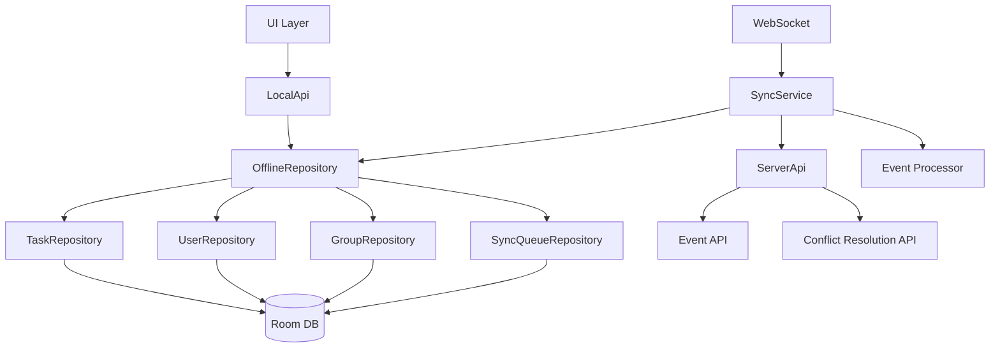
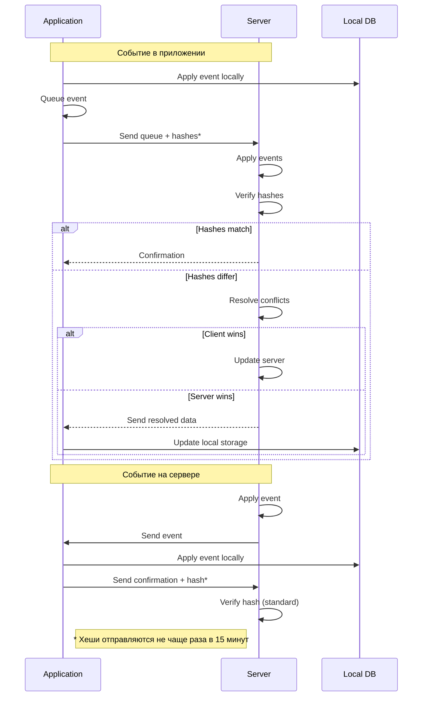

# Стратегия обновления локального хранилища пользователей, задач и групп

## Введение

Этот документ описывает стратегию обновления локального хранилища для пользователей, задач и групп в приложении HomePlanner. Локальное хранилище является постоянным и содержит актуальные данные, а не временный кеш. Цель - оптимизировать синхронизацию, разрешение конфликтов и управление данными в offline-first архитектуре.

## Основные принципы локального хранилища

### Ключевые положения
- **Локальное хранилище — постоянное**: Содержит актуальные данные задач, пользователей и групп. Не является временным кешем, данные не очищаются по времени или размеру.
- **Равнозначность изменений**: Изменения задач на сервере и в приложении равнозначны. Приложение может работать полностью оффлайн.
- **Разрешение конфликтов**: Конфликты разрешаются только на сервере. Серверные изменения не имеют приоритета над локальными.
- **Точечная синхронизация**: Синхронизация происходит по отдельным задачам/пользователям/группам, не полным спискам.
- **Обмен событиями**: При нормальной работе сервер и приложение обмениваются событиями и периодически сверяют состояние.
- **Автономное управление**: Приложение самостоятельно управляет задачами в локальном хранилище.

## Текущая архитектура локального хранилища

### Компоненты
- **TaskCacheRepository**: Управляет задачами в Room Database (TaskCache entity)
  - Постоянное хранение всех задач
  - Нет лимитов по размеру или времени

- **GroupsAndUsersCacheRepository**: Хранение пользователей и групп
  - Пользователи: SharedPreferences (JSON массив)
  - Группы: Не реализованы (заглушки)

- **OfflineRepository**: Основной репозиторий локального хранилища
  - Управляет TaskCacheRepository, SyncQueueRepository, GroupsAndUsersCacheRepository
  - Пересчет задач по новому дню
  - Управление алармами

- **SyncService**: Синхронизация с сервером
  - Синхронизация очереди операций
  - Синхронизация путем сравнения хешей (SHA-256)

### Алгоритм синхронизации
1. Вычисление хеша локальных данных
2. Отправка хеша на сервер
3. Сервер сравнивает с хешем своих данных
4. При различиях - запуск процесса разрешения конфликтов
5. Сервер анализирует конфликты и принимает решение
6. В зависимости от решения: отправка данных на клиент ИЛИ обновление сервера данными клиента
7. Синхронизация данных в правильном направлении

### Проблемы текущей реализации
1. **Неэффективное хранение пользователей**: SharedPreferences не подходит для управления пользователями
2. **Группы не реализованы**: Методы возвращают пустые списки
3. **Дорогая проверка синхронизации**: Вычисление SHA-256 хеша при каждой проверке
4. **Отсутствие точечной синхронизации**: Синхронизация полными списками вместо изменений
5. **Нет механизма разрешения конфликтов**: Отсутствие логики обнаружения и разрешения расхождений

## Требования к обновленной стратегии

### Производительность
- Минимизировать вычислительные затраты на проверку синхронизации
- Оптимизировать хранение и доступ к данным в локальном хранилище
- Уменьшить время загрузки UI из локального хранилища

### Надежность
- Обеспечить консистентность данных между сервером и локальным хранилищем
- Реализовать механизм обнаружения и разрешения конфликтов
- Graceful degradation при ошибках синхронизации
- Восстановление после сбоев

### Функциональность
- Точечная синхронизация отдельных задач/пользователей/групп
- Обмен событиями между сервером и приложением
- Периодическая сверка состояния для обнаружения расхождений
- Равнозначность локальных и серверных изменений при разрешении конфликтов

## Предлагаемая стратегия обновления локального хранилища

### 1. Консолидация хранения данных

**Переход всех данных в Room Database:**
- Создание единой базы данных для задач, пользователей и групп
- Улучшение производительности запросов и транзакций
- Упрощение консистентности данных

**Новые Entity:**
- `UserEntity`: Постоянное хранение пользователей с индексами по ID и имени
- `GroupEntity`: Хранение групп с связями пользователей
- Обновление `TaskEntity` с оптимизациями индексов

### 2. Комбинированная синхронизация

**Точечная синхронизация для изменений:**
- Синхронизация отдельных задач/пользователей/групп по событиям
- Обмен событиями между сервером и приложением через WebSocket/очередь
- Периодическая сверка состояния хешами для обнаружения расхождений

**Механизм обработки событий:**

*Событие в приложении:*
1. Обрабатывается событие, обновляются данные в локальном хранилище
2. Событие записывается в очередь синхронизации
3. При отправке очереди прикладываются результирующие хеши затронутых элементов*
4. Сервер получает события, применяет их к своим данным
5. Сервер сверяет хеши:
   - Хеши совпали → отправка приложению подтверждения
   - Хеши не совпали → запуск разрешения конфликтов

*Событие на сервере:*
1. Обрабатывается на сервере, обновляются данные
2. Отправляется событие приложению
3. Применяется в приложении (обновление локального хранилища)
4. Отправляется на сервер подтверждение + хеш*
5. Стандартная проверка хешей на сервере

*Хеши отправляются не каждый раз, а только если с момента последней отправки хеша для элемента прошло определенное время (15 минут)

### 3. Разрешение конфликтов и сверка состояния

**Механизм обнаружения конфликтов:**
- Сравнение `updated_at` timestamps
- Обнаружение расхождений при сверке состояния
- Равнозначность локальных и серверных изменений

**Типы конфликтов и алгоритмы разрешения:**

1. **Завершение/отмена завершения (completed/uncompleted):**
   - Алгоритм: "Последнее изменение побеждает" - сравнение `updatedAt`
   - Если клиентское изменение новее → применить к серверу
   - Если серверное изменение новее → применить к клиенту

2. **Текущее время напоминания (reminderTime):**
   - Алгоритм: Пересчет заново
   - Сервер пересчитывает reminderTime на основе графика повторений
   - Применяется пересчитанное значение независимо от клиентских изменений

3. **График повторений (тип, длина циклов, исходное время):**
   - Алгоритм: "Последнее изменение побеждает"
   - Сравнение `updatedAt` параметров графика
   - Новое значение побеждает, старое игнорируется

4. **Описание (название, группа, привязка к пользователю):**
   - Алгоритм: "Последнее изменение побеждает"
   - Сравнение `updatedAt` описательных полей

5. **Создание/удаление задачи:**
   - Алгоритм: Строгое правило - создание имеет приоритет над удалением
   - Если задача создана на клиенте и удалена на сервере → сохранить создание
   - Если задача удалена на клиенте и изменена на сервере → сохранить изменения сервера

6. **Общий конфликт при периодической сверке:**
   - Алгоритм: Поэлементный анализ
   - Для каждого конфликтующего элемента применить соответствующий алгоритм из п.1-5
   - Обеспечить консистентность связанных данных

**Общий процесс разрешения конфликтов:**
```
1. Обнаружение расхождения (разные хеши при одинаковых ID)
2. Классификация типа конфликта по измененным полям
3. Применение соответствующего алгоритма разрешения
4. Принятие решения: клиентские данные, серверные данные или их комбинация
5. Синхронизация данных в правильном направлении
6. Обновление хешей после разрешения
```

**Оптимизация хешей:**
- Хеши элементов хранятся отдельно в локальном хранилище
- Хеш пересчитывается только при изменении соответствующего элемента
- Если элемент не менялся, используется сохраненный хеш

**Алгоритм расчета индивидуальных хешей:**

Хеши рассчитываются индивидуально для каждого элемента (задачи, пользователя, группы) одинаково на сервере и в приложении. При периодической сверке отправляется список пар (ID, хеш) для всех элементов.

```
Алгоритм для отдельной задачи:
1. Собрать поля задачи в строку:
   "id|title|description|taskType|recurrenceType|recurrenceInterval|intervalDays|reminderTime|groupId|enabled|completed|assignedUserIds|updatedAt"
   - null поля заменяются на пустую строку ""
   - assignedUserIds сортируется по ID и сериализуется как "id1,id2,id3"
2. Вычислить SHA-256 хеш от этой строки
3. Хеш сохраняется в локальном хранилище вместе с задачей

Алгоритм для отдельного пользователя:
1. Строка: "id|name"
2. SHA-256 хеш
3. Сохранение с пользователем

Алгоритм для отдельной группы:
1. Строка: "id|name|userIds" (userIds как отсортированная строка "id1,id2,id3")
2. SHA-256 хеш
3. Сохранение с группой
```

**Периодическая сверка:**
- Берется строка из индивидуальных хешей всех элементов в порядке возрастания ID
- От этой строки вычисляется общий SHA-256 хеш
- Хеш отправляется на сервер для сверки
- При различиях запускается разрешение конфликтов

**Требования к алгоритму:**
- Консистентная сериализация полей (null → "")
- Детерминированная сортировка списков (assignedUserIds, userIds)
- Одинаковая реализация на клиенте и сервере
- Изменение любого поля изменяет хеш элемента

**Периодическая сверка:**
- Раз в час отправляется хеш всех элементов в порядке возрастания ID
- Выполняется отдельно для пользователей, групп и задач со смещением в 20 минут
- При различиях запускается разрешение конфликтов

## Диаграммы

### Архитектура обновленного локального хранилища



### Поток обработки событий и разрешения конфликтов



## Заключение

Предлагаемая стратегия обновления локального хранилища включает:
- Консолидацию хранения задач, пользователей и групп в единой Room базе данных
- Точечную синхронизацию с обменом событиями вместо синхронизации полными списками
- Механизм обнаружения и разрешения конфликтов с равнозначностью изменений
- Периодическую сверку состояния для поддержания консистентности
- Версионирование для надежных обновлений и миграций

Это обеспечит эффективную работу offline-first приложения с корректным разрешением конфликтов и минимальным трафиком синхронизации.