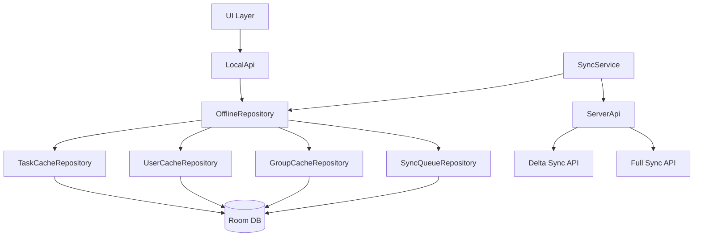
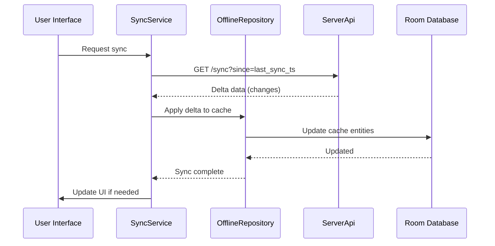

# Стратегия обновления локального кеша пользователей, задач и групп

## Введение

Этот документ описывает стратегию обновления локального кеша для пользователей, задач и групп в приложении HomePlanner. Цель - улучшить производительность, надежность и масштабируемость кеширования, обеспечивая offline-first работу приложения.

## Текущая архитектура кеширования

### Компоненты
- **TaskCacheRepository**: Управляет кэшем задач в Room Database (TaskCache entity)
  - Лимит размера: 20 МБ
  - Retention: 7 дней
  - Автоматическая очистка старых задач

- **GroupsAndUsersCacheRepository**: Кэширование пользователей и групп
  - Пользователи: SharedPreferences (JSON массив)
  - Группы: Не реализованы (заглушки)

- **OfflineRepository**: Основной репозиторий оффлайн-хранилища
  - Управляет TaskCacheRepository, SyncQueueRepository, GroupsAndUsersCacheRepository
  - Пересчет задач по новому дню
  - Управление алармами

- **SyncService**: Синхронизация с сервером
  - Синхронизация очереди операций
  - Синхронизация кэша путем сравнения хешей (SHA-256)

### Алгоритм синхронизации кэша
1. Запрос данных с сервера
2. Вычисление хеша серверных данных
3. Загрузка локального кэша
4. Вычисление хеша локального кэша
5. Сравнение хешей
6. При различиях - обновление кэша

### Проблемы текущей реализации
1. **Неэффективное хранение пользователей**: SharedPreferences не подходит для больших объемов данных
2. **Группы не реализованы**: Методы возвращают пустые списки
3. **Дорогая проверка синхронизации**: Вычисление SHA-256 хеша всего кэша при каждой проверке
4. **Отсутствие версионирования кэша**: Нет механизма инвалидации устаревшего кэша
5. **Ограниченная очистка кэша**: Только по времени доступа, без учета важности данных
6. **Нет приоритетов в очереди синхронизации**: Все операции равнозначны

## Требования к обновленной стратегии

### Производительность
- Минимизировать вычислительные затраты на проверку синхронизации
- Оптимизировать хранение и доступ к данным
- Уменьшить время загрузки UI из кеша

### Надежность
- Обеспечить консистентность данных между кэшем и сервером
- Graceful degradation при ошибках синхронизации
- Восстановление после сбоев

### Масштабируемость
- Поддержка роста объема данных (больше задач, пользователей, групп)
- Эффективная очистка кэша при ограничениях памяти
- Гибкая конфигурация стратегии кеширования

## Предлагаемая стратегия обновления кеша

### 1. Консолидация хранения данных

**Переход всех кэшей в Room Database:**
- Создание единой базы данных для всех типов кэша
- Улучшение производительности запросов
- Упрощение транзакций и консистентности

**Новые Entity:**
- `UserCache`: Кэш пользователей с индексами по ID и имени
- `GroupCache`: Кэш групп с связями пользователей
- Обновление `TaskCache` с оптимизациями

### 2. Оптимизация синхронизации

**Инкрементальная синхронизация:**
- Использование `updated_at` timestamps вместо хешей
- Запрос только изменений с сервера (delta sync)
- Локальная инвалидация устаревших данных

**Алгоритм delta-синхронизации:**
```
1. Получить last_sync_timestamp из метаданных
2. Запросить изменения с сервера: /api/sync?since=last_sync_timestamp
3. Обновить кэш только измененными данными
4. Обновить last_sync_timestamp
```

### 3. Улучшенная стратегия очистки кэша

**Многоуровневая очистка:**
- **LRU (Least Recently Used)**: Удаление давно неиспользуемых данных
- **TTL (Time To Live)**: Автоматическое удаление устаревших данных
- **Важность**: Приоритизация критичных данных (активные задачи, текущий пользователь)

**Алгоритм очистки:**
```
if cache_size > MAX_SIZE:
    удалить expired данные (TTL)
    if still > MAX_SIZE:
        удалить least recently used (LRU)
        if still > MAX_SIZE:
            удалить low priority данные
```

### 4. Приоритеты в очереди синхронизации

**Уровни приоритета:**
- **CRITICAL**: Создание/удаление задач (немедленная синхронизация)
- **HIGH**: Обновление задач, завершение задач
- **NORMAL**: Изменения метаданных, групп
- **LOW**: Необязательные обновления

**Обработка приоритетов:**
- Синхронизация операций по приоритетам
- Таймауты для критичных операций
- Группировка операций для оптимизации

### 5. Версионирование и миграция кэша

**Стратегия версионирования:**
- Версия схемы кэша в метаданных
- Автоматическая миграция при обновлении приложения
- Инвалидация кэша при несовместимых изменениях

**Миграция данных:**
- Постепенная миграция без потери данных
- Fallback на полную синхронизацию при ошибках

## Диаграммы

### Архитектура обновленного кеширования



### Поток delta-синхронизации



## Заключение

Предлагаемая стратегия обновления кеша включает:
- Консолидацию хранения в Room для лучшей производительности
- Delta-синхронизацию для снижения трафика и вычислений
- Многоуровневую очистку кэша с учетом приоритетов
- Приоритизацию операций синхронизации
- Версионирование для надежных обновлений

Это обеспечит более эффективную работу приложения в офлайн-режиме и при синхронизации.